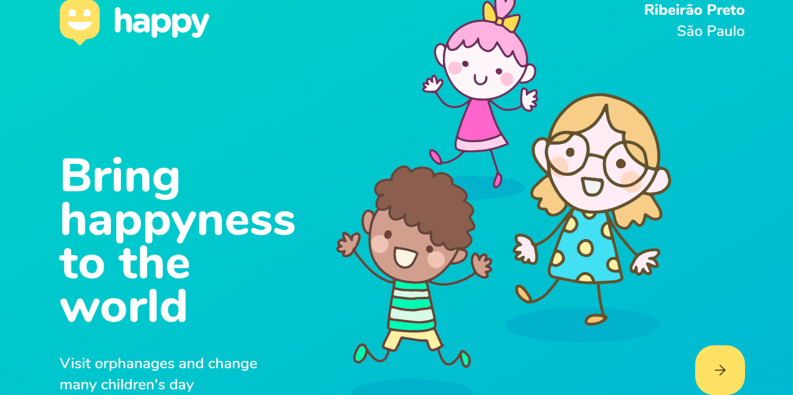

 

# Happy (Orphanages search)

# What it does?

- When the App is executed, you will be able to:

  - Look for a registered orphanage in the map;
  - Check that orphanage's details, such as visit instructions, pictures and opening hours;
  - Register a new orphanage.

## Built with

- React
- Node.js
- React Native

## Live Demo

[Click here to see it on Netlify!](https://happy-front.netlify.app/)

## Getting Started

- Clone the repository on your local machine;
- Cd into the folder;
- Run `yarn install`;
- Run `yarn start`;
- Open your browser and type `localhost:3000`.

## Installations

- Install VSCode or any code editor you like;
- Install yarn by running `yarn install`.

## Author

Murilo Roque Paiva da Silva

Github: [@MuriloRoque](https://github.com/MuriloRoque)

Twitter: [@MuriloRoquePai1](https://twitter.com/MuriloRoquePai1)

Linkedin: [MuriloRoque](https://www.linkedin.com/in/murilo-roque-b1268741/)

## 🤝 Contributing

Contributions, issues and feature requests are welcome! Start by:

- Forking the project
- Cloning the project to your local machine
- `cd` into the project directory
- Run `git checkout -b your-branch-name`
- Make your contributions
- Push your branch up to your forked repository
- Open a Pull Request with a detailed description to the development branch of the original project for a review

## Future features

- Add authentication (Login and Signup) pages;
- Password recovery;
- Add orphanage registration approval;
- Deploy mobile app as APK and IPA;
- User onboarding (tutorial on how to use the app);
- User real location;
- Multiple steps registration (multiple screens).

## Acknowledgements

- This app was built during NLW#3, an event in Brazil that happened in October hosted by [RocketSeat](https://rocketseat.com.br/).

## Show your support

Give a ⭐️ if you like this project!